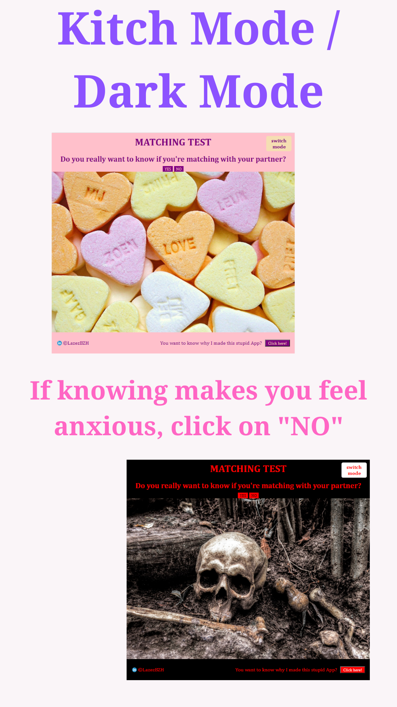
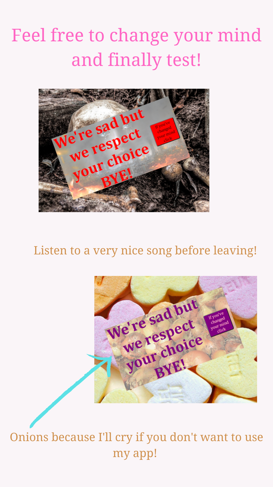
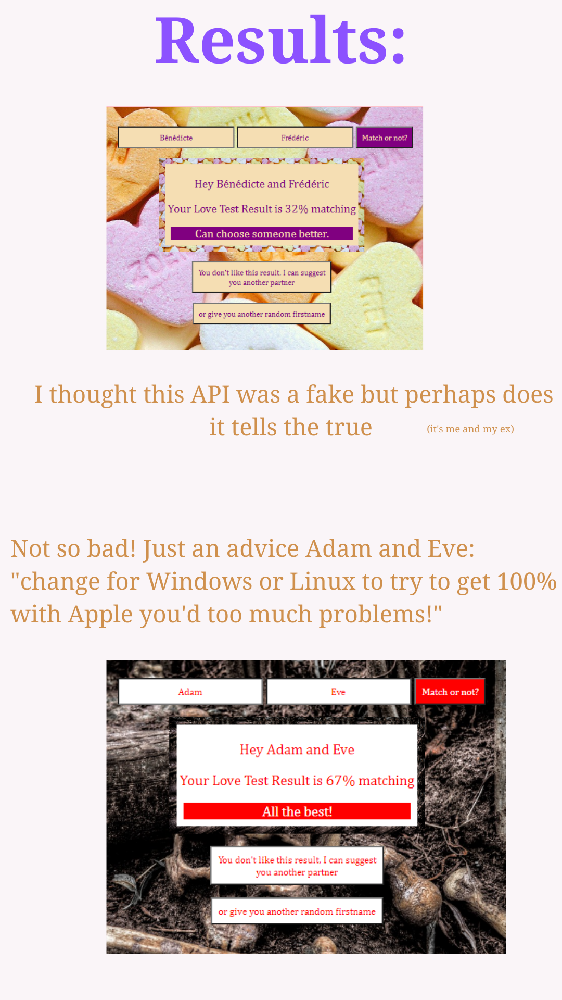
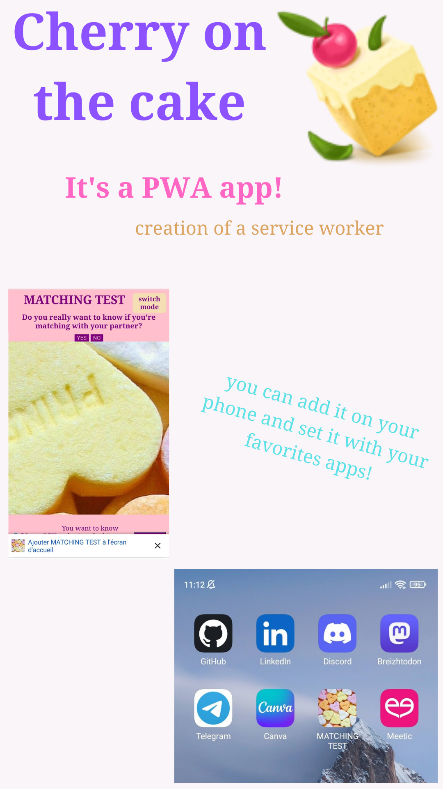
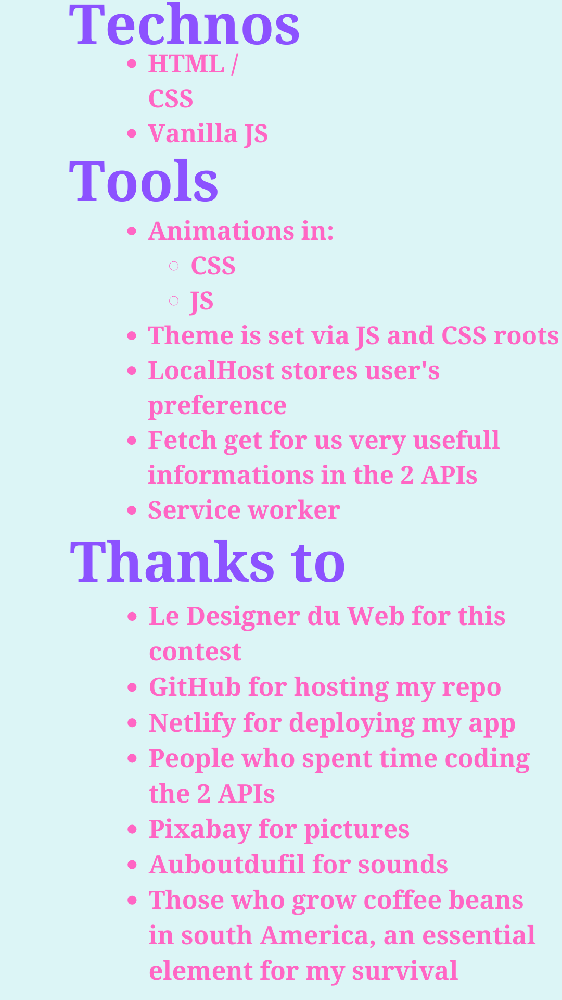

# MATCHING TEST

Application réalisée dans le cadre du concours #' du Designer du Web
Objectif: "Utilisation d'une API REST dans une création web."

- Le concours: [lien Youtube](https://youtu.be/9tSYNQJn6c8)

## Table des matières

- [Consignes](#consignes)
- [Réalisation](#réalisation)
  - [APIs utilisées](#apis-utilisées)
  - [Technos](#technos)
  - [Outils](#outils)
  - [Pour le fun](#pour-le-fun)
 - [Video (in english)](#video)
 - [Sreenshots (in english)](#screenshots)
- [Bilan](#bilan)
- [La voir en action](#la-voir-en-action)
- [Moi](#moi)

## Consignes (Discord)

> Votre travail doit être ORIGINAL et UNIQUE, autant au niveau du DESIGN que du CODE.
Aucune ressemblance avec quoique ce soit sur le web n'est tolérée, sous peine d'être exclu du concours.
Partez d'une feuille blanche et tentez de tout créer de A à Z, on doit pouvoir sentir instantanément que tout vient de vous.
>
> Votre création doit également être faite spécialement pour le concours, dans le temps imparti.
Il est interdit d'utiliser une création qu'on aurait déjà faite, et de participer à un concours avec.
Ce serait injuste envers ceux qui participent dans le temps imparti.

## Réalisation

### APIs utilisées
- Pour obtenir le résultat: [love calculator](https://rapidapi.com/ajith/api/love-calculator/)
- Pour obtenir un prénom aléatoire: [random user](https://randomuser.me/)

### Technos

- HTML
- CSS
- vanilla JS

### Outils

- Animations en:
     - CSS
     - JS
- Thème géré par JS et CSS roots
- LocalHost enregistre les préférences utilisateur
- Fetch pour obtenir les données
- et bien entendu visual studio for code pour coder, versionnig Git, stockage GitHub et déployement Netlify
- Service worker

### Pour le fun

- c'est une PWA
- zolies musiques changeant selon le thème et/ou les résultats

## Video

## Sreenshots

## Bilan

- APi trouvée par hasard alors qu'aucune ne me tentait pour ce concours (et puis on était juste quelques jours après la st Valentin).
- Gros délire sur le design mais c'était obligé ce côté kitch avec une telle API.
- Entrainement en vanilla js (après avoir fait beaucoup de React et un peu de Vue je reviens de plus en plus au vanilla).
- Un peu de galère pour gérer les thèmes et surtout les changements de musiques mais c'est ok.
- Seconde PWA que je fais, la première m'avait fait galérer plusieurs jours, celle-ci m'a juste demandé quelques minutes.

## La voir en action

- Déploiement: [MATCHING TEST](https://matching-test.netlify.app/)

## Moi

- Website - [Bénédicte Hérault](https://lazez-bzh.netlify.app/)
- LinkedIn - [B. HÉRAULT](https://www.linkedin.com/in/benedicte-herault/)
